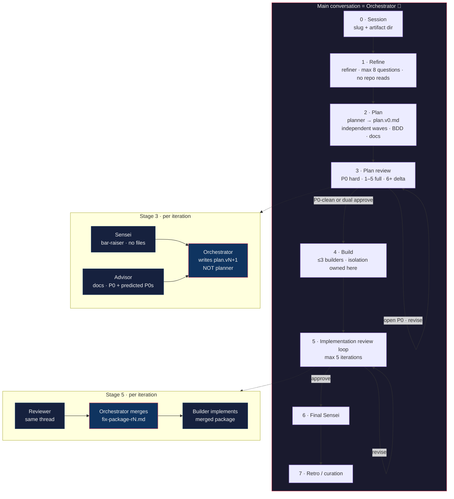

# Agent Playbook

Reusable agents, slash commands, and the **`/e2e`** multi-agent pipeline for Claude Code, Grok Build, Codex, OpenCode, and VS Code.

One source of truth: Markdown under `agents/` and `commands/`. The Makefile only **projects** those files into each harness’s native layout.

---

## Principles

| Rule | Meaning |
| --- | --- |
| **Correctness over delivery convenience** | Complete, durable, auditable work — not velocity, demos, or “good enough for now” |
| **One agent = one file** | Canonical prompts live in `agents/*.md` |
| **Commands are entrypoints** | Thin wrappers; they do not duplicate full agent prompts |
| **Main agent is the brain on `/e2e`** | Never nest a second orchestrator |
| **KISS / DRY / YAGNI** | Simple tooling; regenerate adapters with `make sync-*` |

---

## Quick start

```pwsh
cd path\to\agents

make list                    # agents + commands
make install-personal        # Claude + Grok + Codex (recommended)
# after any edit to agents/ or commands/:
make sync-personal
```

| Invoke | Tool |
| --- | --- |
| `/e2e` | Claude Code, Grok |
| `$e2e` | Codex / Grok skill menu |
| `/plan-this`, `/build-this`, … | single-role shortcuts |

---

## `/e2e` — end-to-end pipeline

**The agent that receives `/e2e` is the Orchestrator.** It stays in the main conversation, holds Juan’s context, and only spawns **leaf** specialists (never another orchestrator).

### Flow diagram



### Stage map

| Stage | Who runs | Output | Notes |
| --- | --- | --- | --- |
| **0 Session** | Orchestrator | `.agents/workspace/tmp/e2e/<slug>/` | One session root |
| **1 Refine** | `refiner` | `refine.md` | Max 8 questions · P0/P1/… · **no file reads** |
| **2 Plan** | `planner` | `plan.v0.md` | Waves must be **parallel-safe** · BDD tables · **docs are deliverables** |
| **3 Plan review** | `sensei` ∥ `advisor` | `plan.v1…vN.md` + `plan-review/*` | **P0 must fix**; iters 1–5 full; **6+ delta-only / no boy scout**; P1+ one pre-build sweep; **LESSONS-LEARNED** + predicted P0s; orchestrator applies revisions |
| **4 Build** | `builder` × waves | `build/wave-*.md` | Max **3** concurrent · mid-tier model if available · **fast tests only (≤~10s)** · orchestrator owns isolation / worktrees |
| **5 Code review** | `reviewer` → **orchestrator merge** → `builder` | `review/reviewer-rN.md` + **`review/fix-package-rN.md`** | Merge all review artifacts **before** builders fix · same reviewer thread |
| **6 Final Sensei** | `sensei` | `sensei-final.md` | No out-of-scope file thrashing |
| **7 Retro** | Orchestrator (+ optional `curator`) | `retro.md` | Critical stage — raise the bar, no shortcuts |

### Identity rules (hard)

```text
/e2e on main
    │
    ▼
┌───────────────────────────────┐
│  MAIN = single Orchestrator   │  ← holds full Juan context
│  spawns only leaf specialists │
└───────────────────────────────┘
    │
    ├── refiner / planner / sensei / advisor
    ├── builder / reviewer / curator / qa
    │
    ✗  NEVER spawn orchestrator
    ✗  NEVER re-invoke /e2e from inside the run
    ✗  NEVER ask planner to write plan.v1+
```

### Artifact tree

```text
.agents/workspace/tmp/e2e/<slug>/
├── refine.md
├── plan.v0.md
├── plan.v1.md … plan.vN.md
├── plan-review/
│   ├── sensei-r1.md …
│   ├── advisor-r1.md …
│   ├── p0-ledger.md
│   └── LESSONS-LEARNED.md
├── build/
│   └── wave-*-report.md
├── review/
│   ├── reviewer-r1.md …      # raw review
│   └── fix-package-r1.md …   # orchestrator-merged work order for builders
├── sensei-final.md
└── retro.md
```

Stage 3 exits when Sensei and Advisor both `approve` **or** the open **P0 ledger is empty** (P1/P2 may remain for a one-time pre-build sweep). From iteration **6+**, review is **delta-only / no boy scout** (P0 only).

Always pass **latest** plan revision downstream. Stale `plan.v{k}` after `plan.v{k+1}` exists is a bug.

### Model tiers (when the harness allows)

| Role | Tier |
| --- | --- |
| Orchestrator, Planner, Sensei | Highest (Opus / Sol / Grok max) |
| Builder, Advisor | Mid (Sonnet / Terra) when available |
| Reviewer | High preferred for correctness-critical work |
| One model only | Use that model for every role — do not invent a weaker path |

---

## Agents

| Agent | Role |
| --- | --- |
| **orchestrator** | Brain for `/e2e` and next-step routing for `/orchestrate-this` |
| **refiner** | Spec from vague intent; E2E mode = ≤8 prioritized questions, no repo reads |
| **planner** | Read-only exploration → decision-complete plan (waves, BDD, docs) — **v0 only** |
| **sensei** | Cross-project bar-raiser; no file reads; anticipatory multi-pass; **predicted future P0s** |
| **advisor** | Project history & **docs only**; P0-hard say-no; **predicted future P0s** from failure catalog |
| **builder** | Obsessive quality (SOLID / KISS / DRY / YAGNI…); fast unit tests only |
| **reviewer** | Design + tests + boy-scout (capped); anticipatory multi-pass |
| **qa** | Black-box end-user validation without reading source |
| **curator** | Session learnings as **candidates** only (no auto-persist) |

Canonical definitions: [`agents/`](agents/).

---

## Commands

| Command | Effect |
| --- | --- |
| **`/e2e`** | Full pipeline — main agent **is** the orchestrator |
| `/orchestrate-this` | Single next-step routing only |
| `/refine-this` | Refiner only |
| `/plan-this` | Planner only |
| `/build-this` | Builder only |
| `/review-this` | Reviewer only |
| `/qa-this` | QA only |
| `/curate-this` | Curator only |

Definitions: [`commands/`](commands/). The `-this` suffix avoids collisions with native tool commands.

---

## Repository layout

```text
agents/           # canonical agent prompts
commands/         # slash / skill entrypoints
adapters/         # harness notes (claude, grok, codex, opencode, vscode)
install/          # PowerShell projectors
Makefile          # install / sync targets
AGENTS.md         # rules for editing this repo
```

---

## Install & sync

```pwsh
make install-personal        # Claude + Grok + Codex personal skills/agents
make sync-personal           # re-run after editing agents/ or commands/

make install-claude-global   # ~/.claude/skills + ~/.claude/agents
make install-grok-global     # ~/.grok/skills
make install-codex-global    # ~/.codex/agents + ~/.agents/skills

make install-claude TARGET=C:/path/to/project
make install-grok   TARGET=C:/path/to/project
make install-opencode        # in-repo OpenCode references
make list
make help
```

| Harness | Personal install |
| --- | --- |
| **Claude Code** | `~/.claude/skills/<name>/SKILL.md` + `~/.claude/agents/<name>.md` |
| **Grok Build** | `~/.grok/skills/<name>/SKILL.md` |
| **Codex** | `~/.codex/agents/*.toml` + `~/.agents/skills/` |
| **OpenCode** | In-repo references (see `adapters/opencode.md`) |
| **VS Code** | Project `.github/prompts` + `.github/instructions` |

Details: [`adapters/claude.md`](adapters/claude.md) · [`adapters/grok.md`](adapters/grok.md) · [`adapters/codex.md`](adapters/codex.md).

**Do not hand-edit generated skills/agents.** Edit `agents/` or `commands/`, then `make sync-personal`.

---

## Editing this repo

See [`AGENTS.md`](AGENTS.md).

1. Change behavior in `agents/*.md`.
2. Change entrypoints in `commands/*.md`.
3. `make sync-personal` (and project targets if you use them).
4. Prefer a new session after large skill changes so harnesses reload cleanly.

---

## Mental model

```text
        Juan
          │
          ▼
     /e2e  (main)
          │
          ▼
   ┌──────────────┐
   │ Orchestrator │◄──────── continuous context
   └──────┬───────┘
          │ leaf specialists only
          ├─► refiner
          ├─► planner ──► plan.v0
          ├─► sensei ─┐
          ├─► advisor ┴─► orchestrator writes plan.vN+
          ├─► builder  (waves / fix-package)
          ├─► reviewer ─► orchestrator merges fix-package ─► builder
          ├─► sensei (final)
          └─► curator (optional candidates)
```

Craft first. Nested brains last (never). Correctness over convenience — always.
