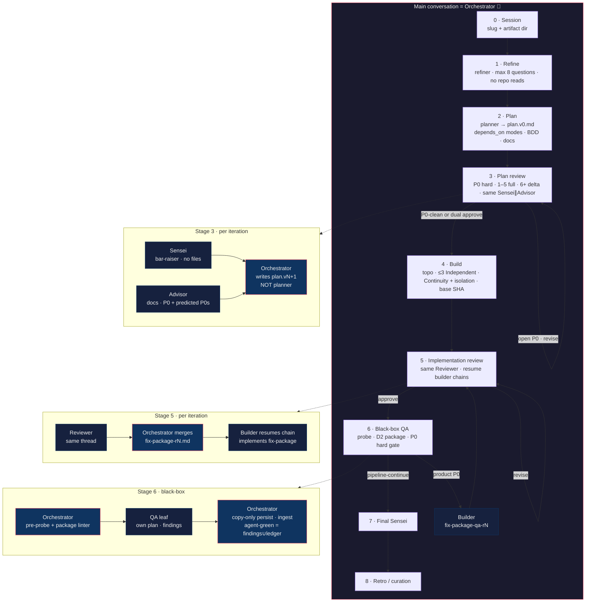

# Agent Playbook

Reusable agents, slash commands, and the **`/e2e`** multi-agent pipeline for Claude Code, Grok Build, Codex, OpenCode, and VS Code.

One source of truth: Markdown under `agents/` and `commands/`. The Makefile only **projects** those files into each harness’s native layout.

---

## Principles

| Rule | Meaning |
| --- | --- |
| **Correctness over delivery convenience** | Complete, durable, auditable work — not velocity, demos, or “good enough for now” |
| **One agent = one file** | Canonical prompts live in `agents/*.md` |
| **Commands are entrypoints** | Thin wrappers; they do not duplicate full agent prompts |
| **Main agent is the brain on `/e2e`** | Never nest a second orchestrator |
| **KISS / DRY / YAGNI** | Simple tooling; regenerate adapters with `make sync-*` |

---

## Quick start

```pwsh
cd path\to\agents

make list                    # agents + commands
make install-personal        # Claude + Grok + Codex (recommended)
# after any edit to agents/ or commands/:
make sync-personal
```

| Invoke | Tool |
| --- | --- |
| `/e2e` | Claude Code, Grok |
| `$e2e` | Codex / Grok skill menu |
| `/e2e-resume` | Claude Code, Grok — continue a stopped `/e2e` session |
| `$e2e-resume` | Codex / Grok skill menu |
| `/plan-this`, `/build-this`, … | single-role shortcuts |

---

## `/e2e` — end-to-end pipeline

**The agent that receives `/e2e` is the Orchestrator.** It stays in the main conversation, holds Juan’s context, and only spawns **leaf** specialists (never another orchestrator).

### Flow diagram



### Stage map

| Stage | Who runs | Output | Notes |
| --- | --- | --- | --- |
| **0 Session** | Orchestrator | `.agents/workspace/tmp/e2e/<slug>/` | One session root · open `session-registry.md` |
| **1 Refine** | `refiner` | `refine.md` | Max 8 questions · P0/P1/… · **no file reads** |
| **2 Plan** | `planner` | `plan.v0.md` | Every wave has **`depends_on`** · **Independent** (`[]`) and/or **Serial** (non-empty) · BDD · **docs are deliverables** |
| **3 Plan review** | `sensei` ∥ `advisor` | `plan.v1…vN.md` + `plan-review/*` | **P0 must fix**; iters 1–5 full; **6+ delta-only intake — report everything, only delta-scope P0s block**; P1+ one pre-build sweep; **LESSONS-LEARNED** + predicted P0s; **same Sensei∥Advisor chains**; orchestrator applies revisions |
| **4 Build** | `builder` × waves | `build/wave-*.md` | **Topo schedule** · max **3** concurrent **Independent** · Serial = `same_session` resume · mid-tier · **fast tests only (≤~10s)** · Continuity **⊥** isolation · **dispatch checklist + exact base SHA** · prefer **manual worktrees with commit** off default branch (harness `isolation: worktree` often births from `main`) · builder **STEP 0** verifies SHA |
| **5 Code review** | `reviewer` → **orchestrator merge** → `builder` | `review/reviewer-rN.md` + **`review/fix-package-rN.md`** | Merge **before** builders fix · **same Reviewer thread** · **MUST resume original builder chain** per owner · also used after Stage 6 product P0 fixes |
| **6 Black-box QA** | Orchestrator probe → `qa` → orchestrator gate | `qa/plan.md`, `qa/findings.md`, `qa/p0-ledger.md`, `qa/probe.md`, `qa/provenance.md` | After Stage 5 **approve** (or Juan named Stage 5 waiver) · D2 package only · **copy-only** persist · **agent-green** vs **pipeline-continue** · product P0 → `fix-package-qa-rN` → Builder (resume chain) → Stage 5 → re-QA · cap 3 product rounds · P0 hard; P1 discretionary; P2 optional · suites ≠ Stage 6 · law: [`docs/findings.md`](docs/findings.md) · role: [`agents/qa.md`](agents/qa.md) · prefer same QA chain (Continuity) |
| **7 Final Sensei** | `sensei` | `sensei-final.md` | Same product revision Stage 6 certified · prefer same Sensei chain · product edits invalidate QA |
| **8 Retro** | Orchestrator (+ optional `curator`) | `retro.md` | Critical stage — raise the bar, no shortcuts |

### Continuity (cross-stage)

When task B depends on A, **reuse the same role-session** (resume when the harness can; else structured **reconstitute**). Closed outcomes: `resumed` \| `reconstituted` \| `cold_start_waived` \| else **BLOCK**. **Silent cold start is forbidden.** Registry: `session-registry.md`. Full law: [`agents/orchestrator.md`](agents/orchestrator.md) **Global Continuity**.

**Claude Serial edges can now reach `resumed`.** Claude Code documents resuming a prior subagent by ID via the `SendMessage` tool, with the transcript persisted under `~/.claude/projects/{project}/{sessionId}/subagents/`; `adapters/claude.md` now asserts `resume_supported: true` (previously `false`) and walks the mechanism end to end. Until the deferred `~/.claude` personal sync (task 7.6b, post-retro) lands, this is **sandboxed-and-provisional**: proven against generated/sandbox targets, not yet against the operator's live `~/.claude` install — so a Claude Serial edge in the current live session still lands on `reconstituted` until 7.6b closes. Details: [`adapters/claude.md`](adapters/claude.md).

**Continuity ⊥ isolation:** workspace isolation (worktrees, exclusive trees) does not create or erase Continuity chains; resume never skips STEP 0 / `expected_base_sha`.

### Identity rules (hard)

```text
/e2e on main
    │
    ▼
┌───────────────────────────────┐
│  MAIN = single Orchestrator   │  ← holds full Juan context
│  spawns only leaf specialists │
└───────────────────────────────┘
    │
    ├── refiner / planner / sensei / advisor
    ├── builder / reviewer / curator / qa
    │
    ✗  NEVER spawn orchestrator
    ✗  NEVER re-invoke /e2e or /e2e-resume from inside the run (either direction)
    ✗  NEVER ask planner to write plan.v1+
```

### Artifact tree

```text
.agents/workspace/tmp/e2e/<slug>/
├── refine.md
├── plan.v0.md
├── plan.v1.md … plan.vN.md
├── plan-review/
│   ├── sensei-r1.md …
│   ├── advisor-r1.md …
│   ├── p0-ledger.md
│   └── LESSONS-LEARNED.md
├── session-registry.md       # Continuity rows (orchestrator-owned)
├── resume-assessment-r1.md … # /e2e-resume state reconstruction packages
├── build/
│   └── wave-*-report.md
├── review/
│   ├── reviewer-r1.md …         # raw review
│   ├── fix-package-r1.md …      # orchestrator-merged work order (Stage 5)
│   └── fix-package-qa-r1.md …   # orchestrator-merged product fixes from Stage 6
├── qa/
│   ├── plan.md                  # QA-authored (orchestrator copy-only)
│   ├── findings.md              # findings + verdict (copy-only)
│   ├── p0-ledger.md             # orchestrator-owned
│   ├── probe.md                 # orchestrator readiness probe
│   └── provenance.md            # session / round / agent / product revision
├── sensei-final.md
└── retro.md
```

Stage 3 exits when Sensei and Advisor both `approve` **or** the open **P0 ledger is empty** (P1/P2 may remain for a one-time pre-build sweep). From iteration **6+**, review stays **delta-scoped**: Sensei and Advisor report everything they see (they no longer filter to P0-only); only a **delta-scope P0** — new in the diff, or a claimed fix that failed/regressed — enters the ledger and blocks the round. Everything else (new P1/P2, drive-by notes, re-litigation) routes to `LESSONS-LEARNED.md` without escalation, not silently dropped.

Always pass **latest** plan revision downstream. Stale `plan.v{k}` after `plan.v{k+1}` exists is a bug.

### `/e2e-resume` — continue a stopped session

If `/e2e` stops before Stage 8 retro (crash, context loss, new conversation, manual pause), run **`/e2e-resume`** instead of restarting. It reassesses which stages actually completed from session artifacts + `session-registry.md` — never from file presence alone — reconciles any mid-flight registry rows, then re-enters the pipeline at the earliest incomplete stage. Reaching Stage 4 build does not mean Stage 5 review, Stage 6 QA, Stage 7 Sensei, or Stage 8 retro can be skipped: each still runs if it did not already close per its own exit criteria. Full procedure: [`agents/orchestrator.md`](agents/orchestrator.md) § **E2E Resume**.

### Model tiers (when the harness allows)

| Role | Tier |
| --- | --- |
| Orchestrator, Planner, Sensei | Highest (Opus / Sol / Grok max) |
| Reviewer, QA, Refiner | High — Stage 5/6 correctness gates (Reviewer, QA) and one-shot session-scoping (Refiner) |
| Builder, Advisor, Curator | Mid (Sonnet / Terra) when available |
| One model only | Use that model for every role — do not invent a weaker path |

`qa`'s row closes a pre-existing documentation gap; `refiner`'s and `curator`'s rows resolve this repo's own previously-documented "Mid or high" range. Full rationale: [`agents/orchestrator.md`](agents/orchestrator.md) § Model tier map.

---

## Agents

| Agent | Role |
| --- | --- |
| **orchestrator** | Brain for `/e2e` and next-step routing for `/orchestrate-this` |
| **refiner** | Spec from vague intent; E2E mode = ≤8 prioritized questions, no repo reads |
| **planner** | Read-only exploration → decision-complete plan (waves, BDD, docs) — **v0 only** |
| **sensei** | Cross-project bar-raiser; no file reads; anticipatory multi-pass; **predicted future P0s** |
| **advisor** | Project history & **docs only**; P0-hard say-no; **predicted future P0s** from failure catalog |
| **builder** | Obsessive quality (SOLID / KISS / DRY / YAGNI…); fast unit tests only; reports `continuity_mode`; accepts Stage 5 **and** Stage 6 `fix-package-qa-rN` work orders |
| **reviewer** | Design + tests + boy-scout (capped); anticipatory multi-pass |
| **qa** | Stage 6 black-box product acceptance (docs + live app; no product source oracle); findings-only; law in [`docs/findings.md`](docs/findings.md) |
| **curator** | Session learnings as **candidates** only (no auto-persist) |

Canonical definitions: [`agents/`](agents/).

---

## Commands

| Command | Effect |
| --- | --- |
| **`/e2e`** | Full pipeline — main agent **is** the orchestrator |
| **`/e2e-resume`** | Reassess a stopped `/e2e` session and continue from the earliest incomplete stage — main agent **is** the orchestrator |
| `/orchestrate-this` | Single next-step routing only |
| `/refine-this` | Refiner only |
| `/plan-this` | Planner only |
| `/build-this` | Builder only |
| `/review-this` | Reviewer only |
| `/sensei-this` | Sensei only |
| `/advisor-this` | Advisor only |
| `/qa-this` | QA only |
| `/curate-this` | Curator only |

Definitions: [`commands/`](commands/). The `-this` suffix avoids collisions with native tool commands.

---

## Repository layout

```text
agents/           # canonical agent prompts
commands/         # slash / skill entrypoints
adapters/         # harness notes (claude, grok, codex, opencode, vscode)
install/          # PowerShell projectors
claude/           # the stop guard: a Stop hook that sends an early finish back
Makefile          # install / sync targets
AGENTS.md         # rules for editing this repo
```

---

## The stop guard

`claude/` holds a `Stop` hook that reads the closing message of a turn. When the
agent named the next step instead of doing it, claimed a number it never
measured, or said BLOCKED with a path still open, the hook sends the turn back.
Patterns decide first; a local model settles what they leave open.

It runs on Claude Code and Grok Build from the same block. Install it with
[`claude/install.ps1`](claude/install.ps1); the why and the knobs are in
[`claude/README.md`](claude/README.md) and [`claude/INSTALL.md`](claude/INSTALL.md).

---

## Install & sync

```pwsh
make install-personal        # Claude + Grok + Codex personal skills/agents
make sync-personal           # re-run after editing agents/ or commands/

make install-claude-global   # ~/.claude/skills + ~/.claude/agents
make install-grok-global     # ~/.grok/skills
make install-codex-global    # ~/.codex/agents + ~/.agents/skills

make install-claude TARGET=C:/path/to/project
make install-grok   TARGET=C:/path/to/project
make install-opencode        # in-repo OpenCode references
make list
make help

make verify-sync             # drift check: regenerated projections vs. live ~/.claude, ~/.grok, ~/.codex, ~/.agents — exits non-zero on drift, IN SYNC/DRIFT/NOT INSTALLED per harness
```

| Harness | Personal install |
| --- | --- |
| **Claude Code** | `~/.claude/skills/<name>/SKILL.md` + `~/.claude/agents/<name>.md` |
| **Grok Build** | `~/.grok/skills/<name>/SKILL.md` — also reads Claude Code's skills/agents/instructions natively, zero config (see `adapters/grok.md`); no separate role-definition dump |
| **Codex** | `~/.codex/agents/*.toml` (`name`/`description`/**`model`**/**`model_reasoning_effort`**/`sandbox_mode`/`developer_instructions`) + `~/.agents/skills/` + `~/.codex/prompts/*.md` (deprecated by Codex, kept one more cycle with a banner) |
| **OpenCode** | In-repo references (see `adapters/opencode.md`) |
| **VS Code** | Project `.github/agents/*.agent.md` (roles) + `.github/prompts/*.prompt.md` (entrypoints) + exactly one always-on `.github/instructions/*.instructions.md` file (Principles table only) |

Every path above exists after a real sync: confirmed for Claude Code/Grok/Codex/OpenCode/VS Code via task 7.6a's in-session `make sync` / `make sync-opencode` / `make install-codex-global` / `make install-grok-global` run; Claude Code's **personal** (`~/.claude`) tree specifically is `~/.claude/agents`/`~/.claude/skills` **pending task 7.6b** (deferred until after this session's retro — see Continuity section above), stated as such rather than implied complete. `docs/harness-conformance.md` is the row-by-row proof ledger.

Details: [`adapters/claude.md`](adapters/claude.md) · [`adapters/grok.md`](adapters/grok.md) · [`adapters/codex.md`](adapters/codex.md) · [`adapters/vscode.md`](adapters/vscode.md) · [`adapters/opencode.md`](adapters/opencode.md).

**Do not hand-edit generated skills/agents.** Edit `agents/` or `commands/`, then `make sync-personal`.

---

## Editing this repo

See [`AGENTS.md`](AGENTS.md).

1. Change behavior in `agents/*.md`.
2. Change entrypoints in `commands/*.md`.
3. `make sync-personal` (and project targets if you use them).
4. Prefer a new session after large skill changes so harnesses reload cleanly.

---

## Mental model

```text
        Juan
          │
          ▼
     /e2e  (main)
          │
          ▼
   ┌──────────────┐
   │ Orchestrator │◄──────── continuous context
   └──────┬───────┘
          │ leaf specialists only
          ├─► refiner
          ├─► planner ──► plan.v0
          ├─► sensei ─┐
          ├─► advisor ┴─► orchestrator writes plan.vN+
          ├─► builder  (waves / fix-package / fix-package-qa)
          ├─► reviewer ─► orchestrator merges fix-package ─► builder
          ├─► qa ─► orchestrator probe + D2 package + copy-only gate
          │         (Stage 6 hard; product P0 → builder → Stage 5 → re-QA)
          ├─► sensei (final, Stage 7 — same revision QA certified)
          └─► curator (optional candidates; Stage 8 retro)
```

Craft first. Nested brains last (never). Correctness over convenience — always. Suites green ≠ Stage 6 black-box QA.
